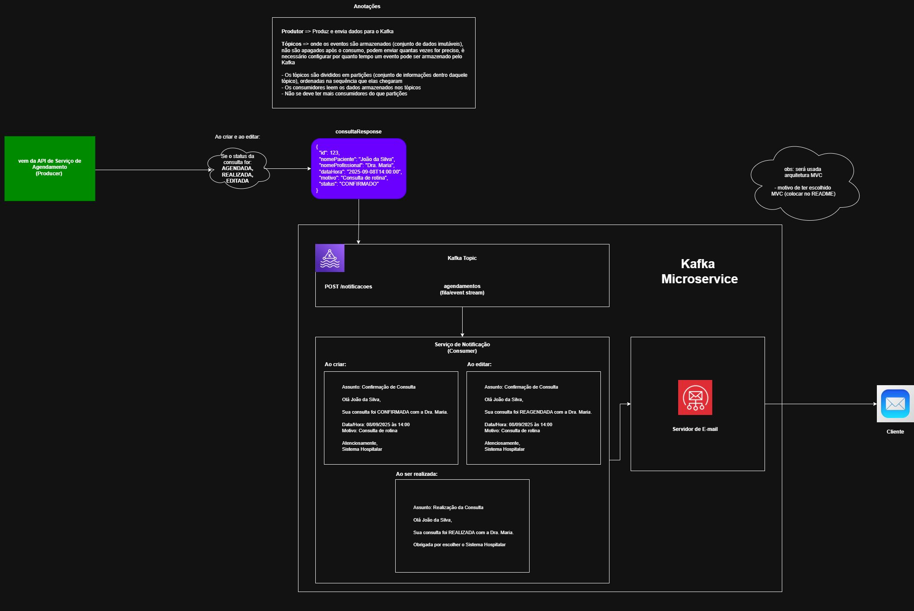

# Estrutura da API de Notificação (MVC)


## 📂 Explicação de cada pasta

### config/ 
→ onde você deixa a configuração do Kafka (KafkaConsumerConfig), Swagger/OpenAPI e Beans gerais.

### controller/ 
→ classes com endpoints REST (@RestController), ex.:

### POST /
notificacoes para receber a notificação.

### dto/ 
→ objetos de entrada/saída do controller (NotificacaoRequest, NotificacaoResponse).

### service/ 
→ onde fica a lógica da aplicação (ex.: processar e salvar notificação, chamar consumer).

### repository/ 
→ interfaces JPA ou implementação de persistência.

### model/ 
→ entidades mapeadas para banco (caso você grave histórico de notificações).

### consumer/ 
→ classes que consomem mensagens do Kafka (com @KafkaListener).

### exception/ 
→ CustomException, GlobalExceptionHandler com @ControllerAdvice.

```
src/main/java/api
├── config/             # Beans de configuração (Kafka, Swagger, etc.)
├── controller/         # Endpoints REST (ex: NotificacaoController)
├── dto/                # Objetos de transferência de dados (Request/Response)
├── service/            # Regras de negócio (NotificacaoService)
├── repository/         # Repositórios JPA ou conexões com DB
├── model/              # Entidades JPA ou modelos usados pelo banco
├── consumer/           # Kafka consumers (mockado agora, real depois)
├── exception/          # Exceptions customizadas e handlers
└── SistemaHospitalarKafkaApplication.java
```

### Arquitetura do Serviço 



## 1️⃣ Visão geral da aplicação

Sua aplicação segue o **padrão MVC** com Kafka integrado:

```
api/
├── dto/              --> Modelagem dos dados
├── producer/config/  --> Configuração do Kafka
├── producer/controller/ --> Controlador REST que envia mensagens
├── producer/services/   --> Serviço/Consumer que recebe mensagens
```

O fluxo geral é:

1. Um cliente (por exemplo, Postman ou frontend) faz uma requisição **POST** para `/consulations`.
2. O **controller** recebe o JSON (`ConsulationDTO`) do body.
3. O controller transforma o objeto em **JSON string** e envia para o **tópico Kafka** `consulations`.
4. O **consumer** está inscrito nesse tópico e recebe as mensagens assim que chegam.
5. O consumer faz alguma ação com a mensagem — no seu caso, apenas imprime no console (mock/teste).

---

## 2️⃣ Detalhe de cada arquivo

### 📄 2.1 `ConsulationDTO.java`

* **Local:** `api.dto`
* **Função:** representa o **modelo de dados da consulta**, que será enviado pelo producer para Kafka.
* Contém:

```java
private Long id;
private String nomePaciente;
private String nomeProfissional;
private LocalDateTime dataHora;
private String motivo;
private String status;
```

* **Lombok** (`@Getter`, `@Setter`, `@AllArgsConstructor`, `@NoArgsConstructor`) reduz código boilerplate.

---

### 📄 2.2 `ConsulationStatus.java`

* Enum que define os **status possíveis da consulta**: `AGENDADA`, `REALIZADA`, `EDITADA`.
* Serve para padronizar os valores enviados via Kafka.

---

### 📄 2.3 `KafkaProducerConfig.java`

* **Local:** `api.producer.configuration`
* **Função:** configura o **producer Kafka** dentro do Spring Boot.
* Define:

1. `ProducerFactory<String, String>` → cria produtores que enviam mensagens.
2. `KafkaTemplate<String, String>` → classe de alto nível do Spring Kafka usada para **enviar mensagens** ao tópico.

* Configurações importantes:

```
configProps.put(ProducerConfig.BOOTSTRAP_SERVERS_CONFIG, "localhost:9092");
configProps.put(ProducerConfig.KEY_SERIALIZER_CLASS_CONFIG, StringSerializer.class);
configProps.put(ProducerConfig.VALUE_SERIALIZER_CLASS_CONFIG, StringSerializer.class);
```

> **Bootstrap server** é o endereço do broker Kafka.

---

### 📄 2.4 `ConsulationController.java`

* **Local:** `api.producer.controller`
* **Função:** camada **REST (controller)** que recebe requisições HTTP e envia para Kafka.
* Fluxo:

```
@PostMapping
public String sendConsultation(@RequestBody ConsulationDTO consulta)
```

1. Recebe `ConsulationDTO` do client.
2. Converte para JSON (`ObjectMapper`).
3. Envia para o **tópico `consulations`** via `kafkaTemplate.send(TOPICO, mensagem)`.

---

### 📄 2.5 `ConsulationConsumer.java`

* **Local:** `api.producer.services`
* **Função:** **listener Kafka** que consome mensagens do tópico.
* Configuração:

```
@KafkaListener(topics = "consulations", groupId = "group-consulation")
public void consume(String mensagem)
```

* Sempre que uma mensagem chega no tópico, esse método é chamado automaticamente.
* No seu mock, ele só **imprime a mensagem no console**, mas em produção poderia salvar no banco, enviar notificações, etc.

---

## 3️⃣ Como o Kafka funciona nesse fluxo

1. **Producer** (via `KafkaTemplate`) envia mensagem JSON para o tópico `consulations`.
2. Kafka armazena a mensagem no tópico, que é **partitionado e replicado** no cluster.
3. **Consumer** (via `@KafkaListener`) lê a mensagem do tópico e executa a lógica definida.

> Ponto importante: Kafka permite **vários consumers** lendo o mesmo tópico, podendo formar **grupos de consumidores** (`groupId`) que dividem as mensagens.

---

## 4️⃣ Pontos-chave da aplicação

* **Controller** → Recebe dados do usuário e envia ao Kafka.
* **ProducerConfig** → Configura o Kafka dentro do Spring Boot.
* **DTO + Enum** → Padronizam os dados que serão enviados.
* **Consumer** → Escuta o tópico e processa mensagens (mock).
* **Kafka** → Fila de mensagens que desacopla produtor de consumidor, permitindo escalabilidade e persistência.

---

Se você quiser, Isabella, posso te **desenhar um diagrama MVC + Kafka** mostrando exatamente o fluxo:

* Endpoint HTTP → Controller → Kafka → Consumer → Ação.

Isso deixa muito mais fácil de visualizar o projeto.

Quer que eu faça esse diagrama?

